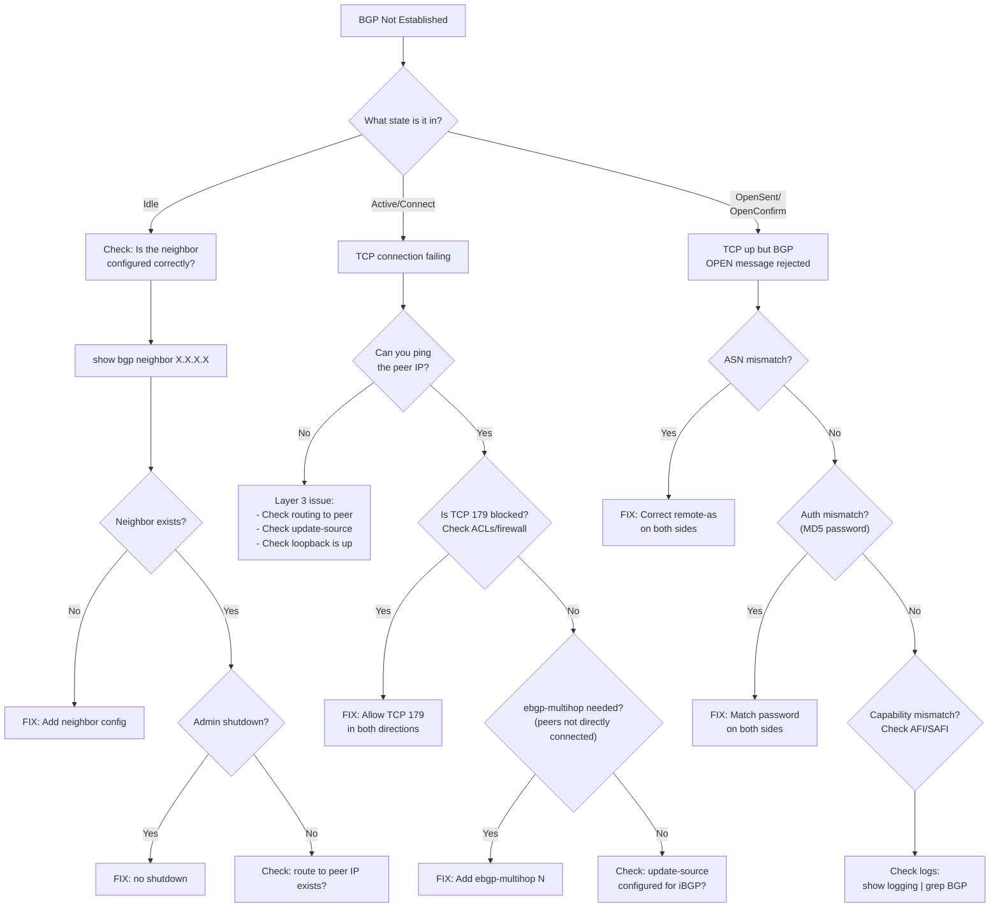

# Decision Tree: BGP Not Established

## Starting Symptom

BGP session stuck in Idle, Active, Connect, or OpenSent — NOT reaching Established.



## Quick Checklist

```bash
# 1. What state are we in?
show bgp neighbor X.X.X.X | grep "BGP state"

# 2. Can we reach the peer?
ping X.X.X.X source Y.Y.Y.Y    # Y = your update-source

# 3. Is anything blocking TCP 179?
show ip access-lists

# 4. Check the OPEN message
show bgp neighbor X.X.X.X | grep -A5 "message statistics"

# 5. Check syslog for BGP errors
show logging | grep BGP
```
