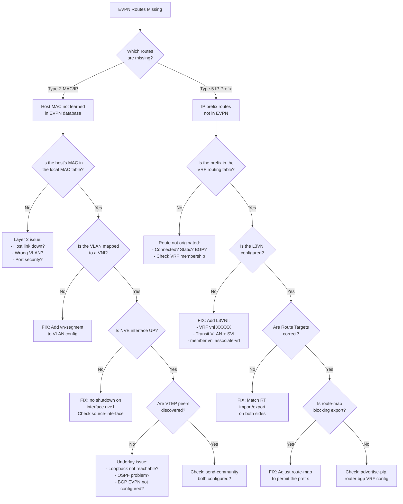

# Decision Tree: EVPN Routes Missing

## Starting Symptom

BGP EVPN session is Established, but expected routes (Type-2 MAC/IP or Type-5 IP Prefix) are not appearing in the EVPN table.



## Quick Checklist

```bash
# 1. Check EVPN database
show bgp l2vpn evpn summary          # How many routes?
show bgp l2vpn evpn route-type 2     # Type-2 hosts
show bgp l2vpn evpn route-type 5     # Type-5 prefixes

# 2. Check NVE/VXLAN
show nve peers                        # VTEP peers discovered?
show nve vni                          # VNIs operational?

# 3. Check VRF / L3VNI
show vrf                              # L3VNI assigned?
show ip route vrf X                   # Prefix in VRF?

# 4. Check communities
show bgp neighbor X.X.X.X            # send-community configured?

# 5. Check route maps
show route-map                        # Any deny statements?
```
