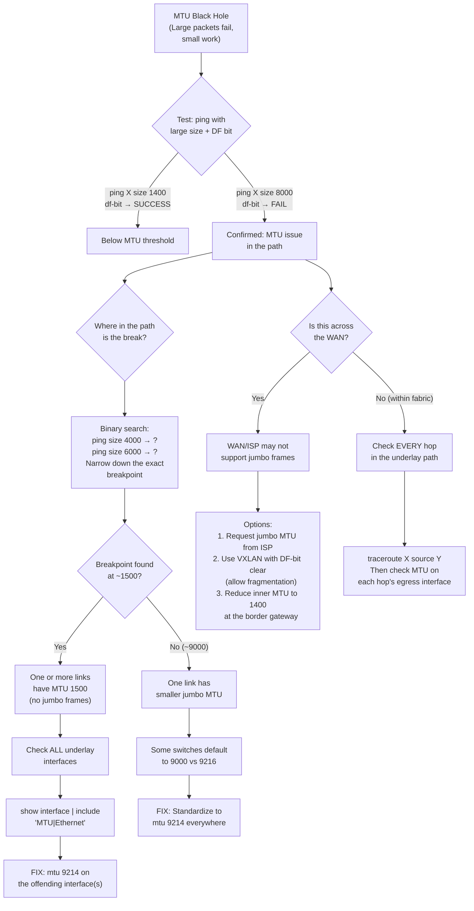

# Decision Tree: MTU Black Hole

## Starting Symptom

Small packets (ICMP, ARP, small HTTP requests) work fine. Large packets (file transfers, database queries, jumbo frames) fail silently. No interface errors reported.



## Quick Checklist

```bash
# 1. Test end-to-end with large frame
ping <remote-host> size 8972 df-bit
ping <remote-host> size 1400 df-bit

# 2. Test underlay loopback-to-loopback
ping <remote-vtep-lo0> source loopback0 size 8972 df-bit

# 3. Check all fabric interface MTUs
show interface | include "MTU|Ethernet"

# 4. Check NVE interface MTU
show interface nve1 | include MTU

# 5. Look for fragmentation counters
show ip traffic | include "fragment"

# 6. Check specific interface
show interface ethX/Y | include "MTU|input error|output error"
```

## Prevention

```
Standard: ALL underlay fabric interfaces = MTU 9214
Verification: After every new device deployment, run:
  show interface | include "MTU|Ethernet" | grep -v 9214
  → This should return NOTHING
```
