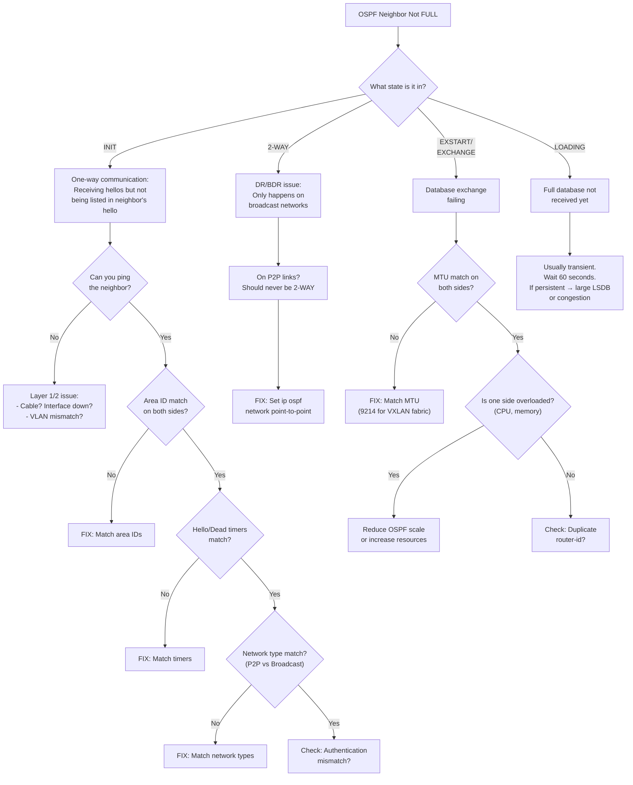

# Decision Tree: OSPF Neighbor Stuck (Not FULL)

## Starting Symptom

OSPF neighbor is visible but stuck in a state other than FULL.



## Quick Checklist

```bash
# 1. What state?
show ip ospf neighbor

# 2. Interface details on both sides
show ip ospf interface ethX/Y
# Must match: area, network type, hello/dead timers, authentication

# 3. MTU check
show interface ethX/Y | include MTU

# 4. Timer check
show ip ospf interface ethX/Y | include "Timer|Hello|Dead"

# 5. Authentication
show ip ospf interface ethX/Y | include "Authentication"
```
