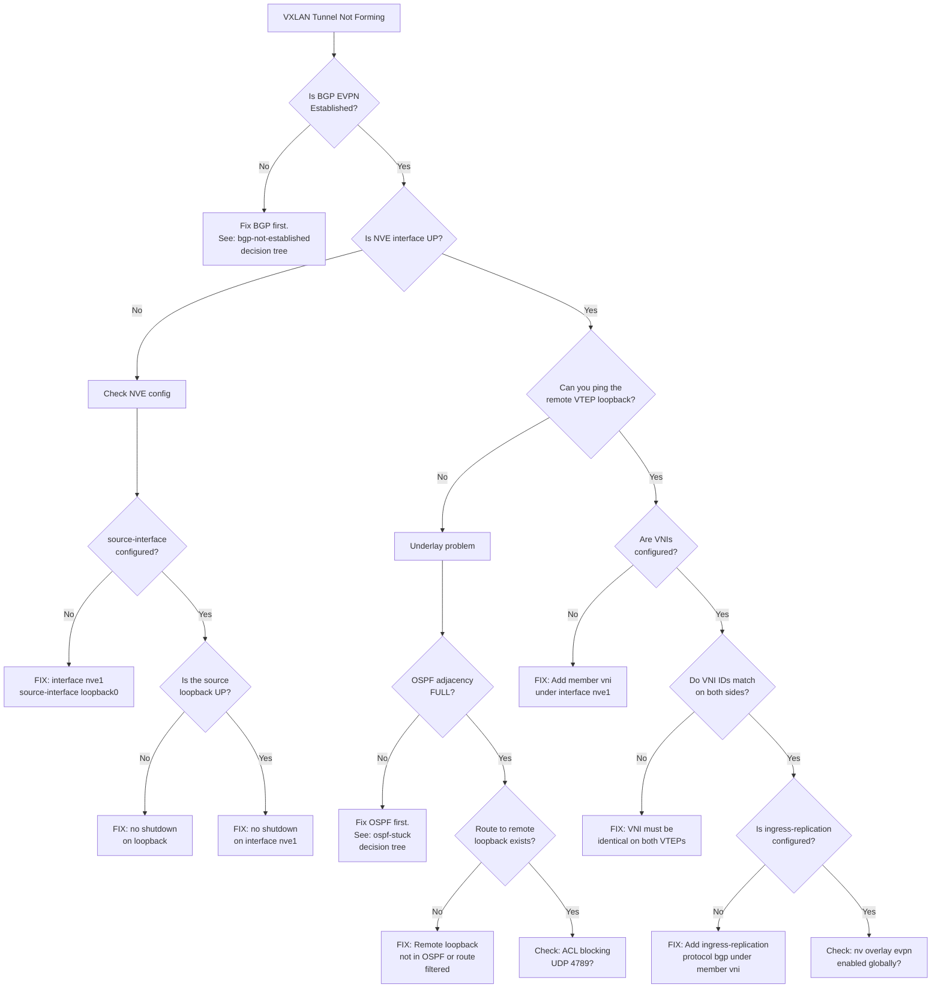

# Decision Tree: VXLAN Tunnel Not Forming

## Starting Symptom

`show nve peers` shows no peers, or specific VTEPs are missing. BGP EVPN may or may not be established.



## Quick Checklist

```bash
# 1. NVE interface status
show interface nve1

# 2. NVE peers
show nve peers

# 3. VNI status
show nve vni

# 4. Underlay reachability
ping <remote-vtep-loopback> source <local-loopback>

# 5. BGP EVPN routes
show bgp l2vpn evpn summary
show bgp l2vpn evpn route-type 3   # Inclusive multicast (one per VNI/VTEP)

# 6. Feature check
show feature | include "nv overlay|vn-segment"
```
